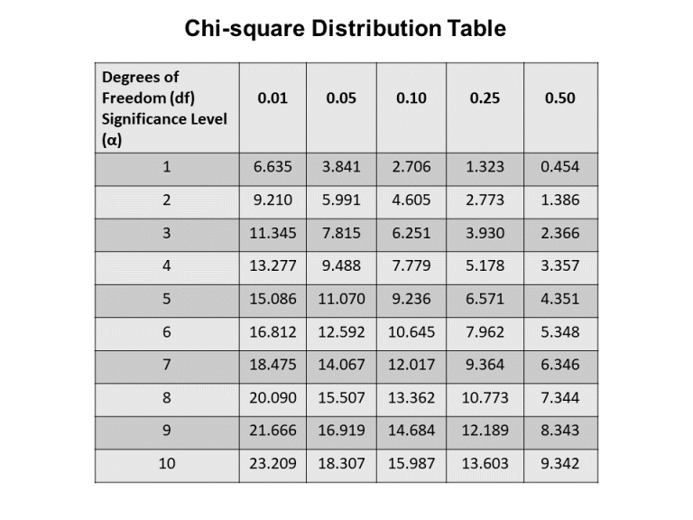
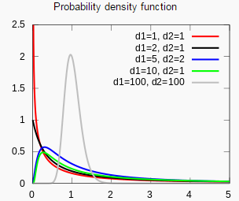
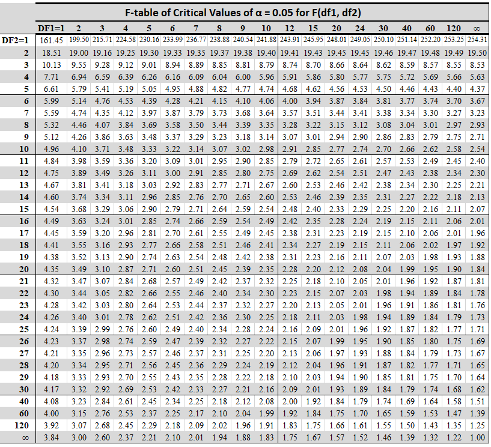

# ML Hypothesis Testing

Have you ever come across p-values, t-statistics, or F-values while building regression or logistic models and wondered what they actually mean? Do they impact the model’s performance? Why do people often suggest removing features with a p-value greater than 5%?

All of these questions tie back to hypothesis testing. In this discussion, we’ll break down these concepts step by step and explore them in depth.

## What is Hypothesis Testing?

In statistics and machine learning, we often estimate population parameters (like means, variances, or regression coefficients) using sample data. But how do we know whether these estimates truly reflect the population? Can we trust them?

That’s where hypothesis testing comes in—it provides a structured way to test assumptions, validate results, and decide whether our findings are statistically significant or just due to random chance.

## Steps in Hypothesis Testing  

The basic steps in hypothesis testing begin with two statements:  

- **H0 (Null Hypothesis):** The starting assumption  
  *(always written with =, ≤, or ≥)*  

- **H1 (Alternative Hypothesis):** The opposite of the initial assumption  
  *(always written with ≠, >, or <)*  

### Example  

Let’s say Amazon sales in **July 2025** were claimed to be **is $10 billion**.  

- **H0 :** Total sales = $10 billion  
- **H1 :** Total sales ≠ $10 billion  

Here, we have set up a hypothesis about our claim.

When testing hypotheses, there are only two possible outcomes:  

- **Reject the Null Hypothesis (H0)**  
- **Fail to Reject the Null Hypothesis (H0)**  

**Important**: There is **no such thing as “accepting” the null hypothesis**.  
We can only say that we **do not have enough evidence to reject it**.  

--- 
### Critical Values and Test Types  

Let’s say our **sample valuation** comes out to be **$9 billion**.  
Since it’s based on a sample, there’s always some error. Assume the error margin is **± $1 billion**.  

That means our possible **population range** could be between **$7 billion and $10 billion**.  

### Critical Values  

When we test a claim, we define **critical values**:  

- **LCV (Lower Critical Value)**  
- **UCV (Upper Critical Value)**  

These values act as **boundaries** that help us decide whether to reject the null hypothesis.  

### Two-Tailed Test (≠ case)  

If our claim is an **equation or equality** (e.g., *H0: Sales = $10B*),  
we are interested in **both directions** (greater or smaller than the claim).  

- **Reject H0** if the observed value lies **below LCV** or **above UCV**.  

### One-Tailed Test (≤ or ≥ case)  

If our claim is **one-sided**, then we only care about **one direction**.  

- **Left-tailed test (≤)** → Reject H0 if observed value < LCV.  
- **Right-tailed test (≥)** → Reject H0 if observed value > UCV.
  

---

### Making Decisions:

There are different methods to make a decision for the given claims.

#### a) Critical Value Method:

 - First, we need to assume an error margin, which we call the significance level (α).
 - Let’s take α = 5%. Based on this α and the type of test, we calculate the Lower Critical Value (LCV) and Upper Critical Value (UCV).
 - Finally, we make a decision by comparing the sample mean (x̄) with the calculated critical values.

Example : 
- **H0 :** Total sales = $10 billion
- **H1 :** Total sales ≠ $10 billion
- α=0.05 , x̄ = 9, σ=2, n=40

Formula

  LCV = μ0​ − zα/2​⋅(σ / √n)

  ​UCV = μ0​ + zα/2​⋅(σ / √n)

  We need the z-score that cuts off the upper 2.5% of the distribution.

  - The cumulative probability at that point is 1 − 0.025 = 0.975

  - Looking up in the z-table: 𝑧 = 1.96

    Steps
     - Standard Error (SE) = (σ / √n) = 2 /√40 ≈0.316
     - Critical values
       - Margin of error = zα/2​⋅(σ / √n) = 1.96 × 0.316 ≈ 0.619
       - 𝐿𝐶𝑉 = 10 − 0.619 = 9.381
       - UCV=10+0.619=10.619

So, the acceptance region is: [9.381, 10.619]

   - Compare sample mean
     - Since  9<9.381, it falls outside the acceptance region.
     - Decision: Reject H0
  

---
 #### b) P-Value Method:

The p-value is the probability of obtaining a test statistic at least as extreme as the one observed, assuming the null hypothesis is true.

- A high p-value indicates strong evidence to fail to reject H0.

- A low p-value (less than the chosen significance level α) provides evidence to reject H0.

Steps
- Calculate the Z-score for the sample mean.
- Find the p-value from the cumulative probability of the given Z-score using the Z-table.
- For a two-tailed test, multiply the p-value by 2.
- Decision rule: If  p≤α, reject H0; otherwise, fail to reject H0.
  

 

Example : 
- **H0 :** Total sales ≤ $10 billion
- **H1 :** Total sales > $10 billion
- α=0.05 , x̄ = 9, σ=2, n=40

Formula

  Z-Score  = (x̄ -  μ0​) / (σ / √n)
  
  Steps
  
   - Standard Error (SE) = (σ / √n) = 2 /√40 ≈0.316
   - Z -Score : (9 - 10) / (0.316) ≈−3.16
   - Find cumulative probability (From the Z-table):
     - P(Z<−3.16)≈0.0008
   - Since it’s a two-tailed test:
     - p-value=2×0.0008=0.0016
   - Compare with α
     - p=0.0016<0.05
   - Decision: Reject H0
   ​
---
 #### c) T - Distribution:
 
It is also referred to as the Student’s t-distribution.

The t-distribution is generally used when the population standard deviation is unknown, and we estimate it using the sample standard deviation. It is especially useful for small sample sizes, as it accounts for the extra uncertainty introduced by estimating σ

- Use Z-test / P - Value : when population σ is known.

- Use T-test: when population σ is unknown, and you estimate it with the sample standard deviation s

Formula
t = (x̄ -  μ0​) / (S / √n)

Steps:
- Calculate the test statistic (t-score)
- Find degrees of freedom (df) = (n-1)
- Determine the critical value(s) from the t-table (based on α, one-tailed or two-tailed, and df)
- Decision rule

 - If ∣t∣>t critical, reject H 0.
 - Otherwise, fail to reject H 0.

  
  
 

Example:

A company claims the average delivery time is 30 minutes. You take a random sample of 25 deliveries, and the results show:

- Sample mean (x̄) = 32 minutes

- Sample standard deviation (s) = 4 minutes

- Significance level (α) = 0.05

Steps : 
H0​:μ=30
H1​:μ=30
- Test statistic (t-score)
  - t =   (x̄ -  μ0​) / (S / √n) = (32−30)/(4 / √25) = 2.5
- df : n-1 = 24
- Critical value from t-table
  - At α=0.05 (two-tailed) and df=24:
     - t0.025,24​≈2.064
- Decision : Since t=2.5>2.064, we reject H0

---
d) Chi-Square Test (Goodness-of-Fit / Categorical counts) :

compare observed counts in categories to expected counts , if observed counts are much different from expected, reject the assumed distribution.

Formula

χ2 = ∑( (O−E)2/E​ )
- E → Expected
- O → Observed

 

Example : 
claim : We want to test if a coin is fair (i.e., probability of heads = 0.5)

Number of times coin flipped = 100

Steps : 

H0 : p = 0.5
H1 : p ≠ 0.5

Let say after fliping 100 times observed is 60 heads , 40 tails

 - Observed Heads (O1) = 60

 - Observed Tails (O2) = 40

Expected :
 - Expected Heads (E1) = 50
 - Expected Heads (E2) = 50

Steps : 
- χ2 = ∑( (O−E)2/E​ ) = (60 - 50)2 / 50 + (40 - 50)2 / 50 = 4
- Degrees of Freedom : k(Number of categories)−1=2−1=1
- For α = 0.05 and df = 1:
   - Critical value (χ20.05,1) ≈ 3.841

- Since χ² (4) > 3.841 → reject H0 .

---
f) ANOVA (Analysis of Variance) / F- Statistics :

→ If we only had 2 groups, we’d just use a t-test. But for 3 or more, doing multiple t-tests increases the chance of error.

ANOVA solves this by comparing:

- Variation between groups (how far group means are from the overall mean).

- Variation within groups (how spread out the data is inside each group).

Formula:

 F = Variance between Groups / Variance within Group 
   = Mean squared between groups / Mean squared within groups 
   = ​MSbetween / MSwithin
   
 - MSbetween =  SSbetween / dfbetween
   - SSbetween : Sum of squares between groups (differences of group means from overall mean)
      - SSB= Σg=1k ng (x̄g − x̄..)²
   - dfbetween : k−1 (k = number of groups)
 - MSwithin=  SSwithin / dfwithin
   - SSwithin : Sum of squares within groups (variation inside each group).
      - SSW = Σg=1k Σi=1ng (xig − x̄g)²
   - dfwithin : N−k (N = total sample size)
	
	​​

 

Example : 
Data (scores by teaching method)
- Group A: 85, 90, 88
- Group B: 75, 78, 94
- Group C: 92, 94, 96

Steps :

- Hypothesis :
  - H 0 : μA ​= μB ​= μC
  - H 1 : At least one group mean is different
- Parameters
  - nA = 3 , nB = 3, nC = 3
  - Number of groups k=3.
  - Grouped means
    - x̄A = (85+90+88)/3 = 87.67
    - x̄B = 75.67
    - x̄C = 94
  - x̄ = 85.78 (overall mean)

 - SSB = nA × ((x̄A - x̄ )2) + nB × ((x̄B - x̄ )2) + nC × ((x̄C - x̄ )2) = 521.37
 - SSW
   - Group A = Σi=1nA (xiA − x̄A)² = (85 - 87.6)2 + (90 - 87.6)2 + (88 - 87.6)2 = 7.11
   - Group B = Σi=1nB (xiB − x̄B)² = 10.66
   - Group C = Σi=1nC (xiC − x̄C)² = 8
   - SSW = Σ Groups = 7.11 + 10.66 + 8 = 25.77
 - dfbetween =  k−1 (k = number of groups) = 3 - 1 = 2 (df1)
 - dfwithin : N−k (N = total sample size) = 9 - 3 = 6 (df2)
- MSbetween =  SSbetween / dfbetween = 521.37 / 2 = 260.68
- MSwithin=  SSwithin / dfwithin = 25.77 / 6 = 4.3
- F = ​MSbetween / MSwithin = 260.68 / 4.3 = 60.62
- From f-table df1 = 2,df2 = 2, α=0.05
  -  F - critical = 5.14
 
- F - statistic (60.62) > F - critical (5.14)  → reject H0 
  
 
      
	​

 ​​
